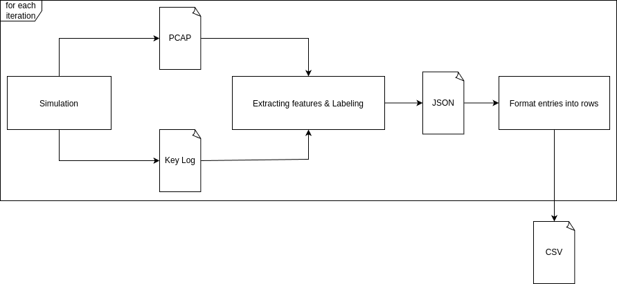
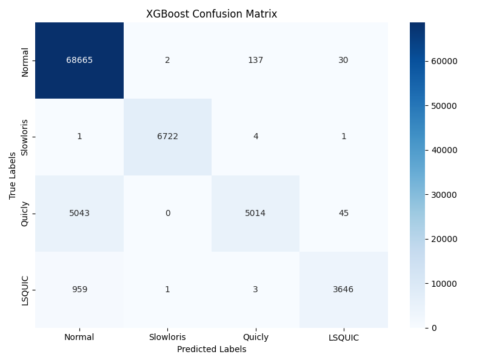

# Thesis Project: Machine learning detection of QUIC attacks

This project is a setup for detecting different QUIC attacks using machine learning methods. The provided code is not a framework as it needs configured hardware for the simulation. Besides the simulation, this project includes the processing and transformation of the packet capture files into flow- and packet-based datasets. The main emphasis is on training different machine learning models to detect those attacks.

## Project Structure
```
/home/philipp/Documents/Thesis/
├── src/
│   ├── file_processing/
│   ├── model_evaluation/
│   ├── isolation_forest/
│   ├── xgboost/
│   ├── ocsvm/
├── session_Datasets/                  
├── packet_capture/                   
├── result_files/      
├── images/                   
├── attacks/                                       
```
## Simulation

The simulation script has to be configured with the SSH parameters to connect to the client and server devices. It includes multiple simulation functions for the different kinds of attacks. They are executed with the generation functions for defining the number of iterations and boundaries which are variable.

```bash
simulate_loris_traffic_isolation(){
    ...
}

generation_loris_isolated(){
    ...
}
```

After the configuration and costmization the simulation is just exevuted with this script:

```bash
./traffic_simulation.sh
```

## File processing 

To extract the packet-level features from the packet capture files, the script process_all_pcaps.sh is needed to produce the JSON files, afterwards, the script json_to_packetscsv.py is used to produce the final dataset.

```bash
./process_all_pcaps.sh
python3 json_to_packetscsv.py
```


For the flow based Dataset, the packet capture files are directly extracted into the .csv files using the netml_feauture extraction_to_csv.py

```bash
python3 netml_feauture extraction_to_csv.py
```
## Machine Learning Training

The machine learning models are tuned for the best hyperparameters inside the directory with the corresponding name in the src directory. 

## Model evaluation

In the model directory, evaluation files for comparing the model's performance and plots are included, for example, confusion matrics as seen below.


